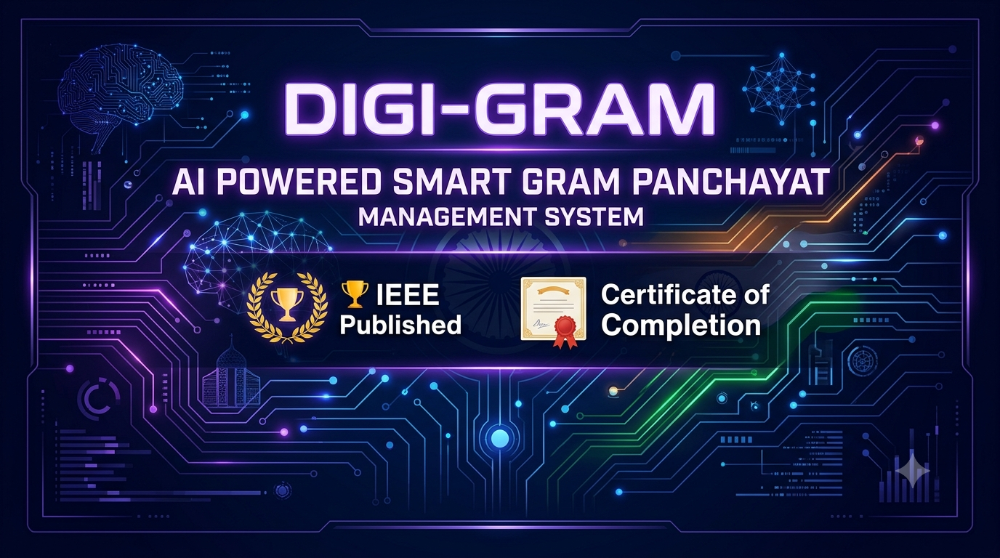
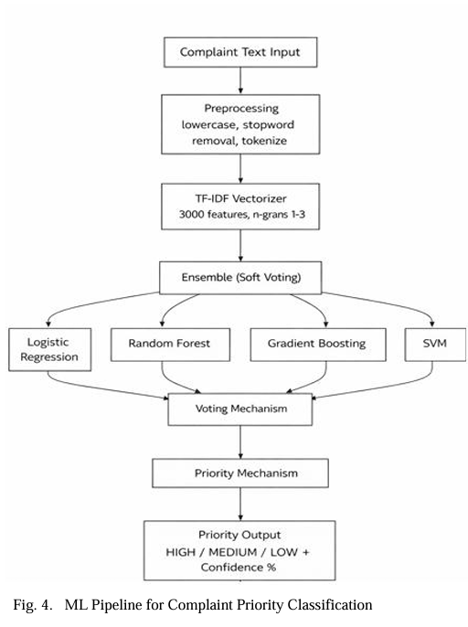
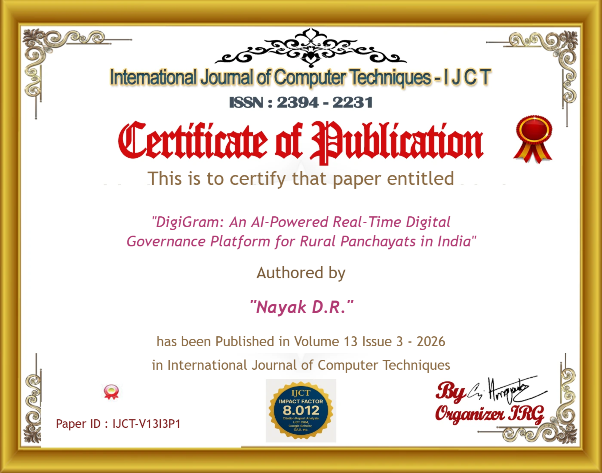

<!-- Banner -->

<p align="center">
  
</p>

---

<h1 align="center">Digi-Gram</h1>

<h3 align="center">
AI-Powered Real-Time Digital Governance Platform for Rural Panchayats in India
</h3>

<p align="center">


</p>

🚀 AI Powered • 🌍 GIS Enabled • 🤖 Machine Learning • 📄 Published Research • 🏛️ Smart Governance

</p>

---

## 📖 About Digi-Gram

**Digi-Gram** is an AI-powered digital governance platform developed to modernize the functioning of Gram Panchayats through intelligent automation, digital services, and real-time analytics.

The platform enables citizens and administrators to efficiently manage complaints, government schemes, tax payments, certificates, village census, GIS-based assets, and public services from a single unified system.

By integrating Artificial Intelligence, Machine Learning, OCR, NLP, GIS, and Full-Stack Web Technologies, Digi-Gram aims to improve transparency, reduce manual work, and deliver faster, smarter, and citizen-centric governance.

---

# 📑 Table of Contents

- [📖 About Digi-Gram](#-about-digi-gram)
- [✨ Key Features](#-key-features)
- [🛠️ Tech Stack](#️-tech-stack)
- [🏗️ System Architecture](#️-system-architecture)
- [🤖 AI Workflow](#-ai-workflow)
- [📂 Repository Structure](#-repository-structure)
- [📚 Documentation](#-documentation)
- [📄 Research Publication](#-research-publication)
- [📜 Certificate of Completion](#-certificate-of-completion)
- [🗺️ Future Scope](#️-future-scope)
- [🤝 Contributors](#-contributors)
- [📄 License](#-license)

  ---

# ✨ Key Features

## 👥 Citizen Services

- 📝 Online Complaint Registration
- 📢 Government Scheme Information
- 📄 Online Certificate Requests
- 💳 Digital Tax Payment
- 📱 Mobile-Friendly Interface

---

## 🤖 AI-Powered Features

- 🧠 AI Complaint Prioritization
- 💬 Intelligent Chatbot Assistance
- 📄 OCR-Based Document Processing
- 🏷️ Automatic Complaint Categorization
- 📊 Predictive Analytics & Insights

---

## 🏛️ Administrative Features

- 👨‍💼 Secure Admin Dashboard
- 📊 Complaint Analytics
- 🗺️ GIS-Based Village Asset Mapping
- 👥 User & Staff Management
- 📈 Real-Time Reports
- 🔔 Notifications & Status Tracking

---

## 🔐 Security

- 🔑 Role-Based Authentication
- 🛡️ Secure REST APIs
- 🔒 Encrypted User Data
- ✅ Input Validation

- ---

# 🛠️ Tech Stack

<table align="center">
<tr>

<td align="center" width="180">

### 💻 Frontend

React.js

HTML5

CSS3

JavaScript

Bootstrap

</td>

<td align="center" width="180">

### ⚙️ Backend

Java

Spring Boot

Spring Security

REST APIs

Hibernate (JPA)

</td>

<td align="center" width="180">

### 🗄️ Database

MySQL

Firebase

MongoDB

Cloudinary

</td>

</tr>

<tr>

<td align="center">

### 🤖 AI & ML

Python

BERT

NLP

OCR

OpenAI API

Hugging Face

</td>

<td align="center">

### 🗺️ GIS

QGIS

Leaflet.js

OpenStreetMap

GeoJSON

</td>

<td align="center">

### ☁️ Tools

Git

GitHub

Docker

Render

Postman

VS Code

</td>

</tr>

</table>

---

## 🏆 Technologies Used

<p align="center">


</p>

---

# 🏗️ System Architecture

<p align="center">


</p>

The Digi-Gram platform follows a modular Full-Stack architecture where citizens interact with a React-based frontend, which communicates securely with Spring Boot REST APIs. The backend integrates AI modules for complaint prioritization, OCR, NLP, chatbot services, GIS mapping, and analytics while storing structured and semi-structured data using MySQL, Firebase, and MongoDB.

---

# 🤖 AI Workflow

<p align="center">



</p>

---

# 🤖 AI Workflow

```text
Citizen Complaint
        │
        ▼
Complaint Registration
        │
        ▼
Text Preprocessing
(Lowercase • Stopword Removal • Tokenization)
        │
        ▼
TF-IDF Feature Extraction
(3000 Features • N-grams 1–3)
        │
        ▼
Ensemble Machine Learning Model
(Logistic Regression + Random Forest +
 Gradient Boosting + SVM)
        │
        ▼
Soft Voting Mechanism
        │
        ▼
Priority Classification
(HIGH • MEDIUM • LOW)
        │
        ▼
Confidence Score Generation
        │
        ▼
Admin Dashboard & Analytics
```

### AI Pipeline Overview

The complaint text submitted by the citizen undergoes preprocessing, including text normalization, stopword removal, and tokenization. The processed text is transformed into numerical feature vectors using the **TF-IDF Vectorizer**. These features are evaluated by an **ensemble of machine learning models** consisting of Logistic Regression, Random Forest, Gradient Boosting, and Support Vector Machine (SVM). The final priority is determined using a **Soft Voting Classifier**, which predicts whether the complaint should be classified as **High**, **Medium**, or **Low** priority along with a confidence score. The prediction is then displayed on the administrative dashboard for efficient complaint management.

---

# 📂 Repository Structure

```text
Digi-Gram
│
├── assets/
│
├── backend/
│
├── frontend/
│
├── ml-models/
│
├── docs/
│
├── README.md
│
├── LICENSE
│
└── .gitignore

```

# 📄 Research Publication

🏆 The research work behind **Digi-Gram** has been successfully published in the **International Journal of Computer Techniques (IJCT)**.

### 📚 Publication Details

| Field | Details |
|-------|---------|
| **Paper Title** | DigiGram: An AI-Powered Real-Time Digital Governance Platform for Rural Panchayats in India |
| **Journal** | International Journal of Computer Techniques (IJCT) |
| **ISSN** | 2394-2231 |
| **Volume** | 13 |
| **Issue** | 3 |
| **Year** | 2026 |
| **Paper ID** | IJCT-V13I3P1 |
| **Author** | Durvesh Rajesh Nayak |

### 📎 Resources

## 📎 Research Paper

> 📖 **[Click here to read the published research paper](docs/IEEE_DigiGram_Research%20Paper_2026.pdf)**


---

# 📜 Certificate of Publication

<p align="center">
  
</p>

The successful completion and publication of this research validates the technical contribution of **Digi-Gram** in the field of Artificial Intelligence, Smart Governance, and Digital Transformation for Rural India.

The certificate is included in the **docs/** directory for reference.

---

# 🤝 Contributors

<table align="center">
<tr>

<td align="center" width="250">

### 👨‍💻 Durvesh Rajesh Nayak

**Full Stack Developer**

AI Integration • Backend • System Architecture

</td>

<td align="center" width="250">

### 👨‍💻 Harish Hulyalkar

**Full Stack Developer**

Frontend • Backend • Application Development

</td>

<td align="center" width="250">

### 👨‍💻 Parthamesh Mulik

**Full Stack Developer**

Frontend • Backend • System Development

</td>
## 🎓 Project Guide

*Supriya Chougule*

Project Mentor

</td>

</tr>
</table>

---

# 📄 License

This project is intended for **academic, research, and educational purposes**.

© 2026 Durvesh Rajesh Nayak. All Rights Reserved.


